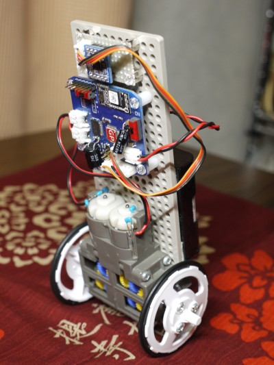

Pendolino2
=========

## 概要
GPduinoを使った倒立振子です。  

## 回路
- GPduinoのI2CポートにMPU6050を接続します。
- GPduinoのDCモータポートにFA130モータ2個を接続します。
- 電源はニッケル水素単三電池4セル（4.8V）を使用します。
- ノイズ対策のため、モータには0.1uFのコンデンサを付けることを推奨します。
- 電源強化のため、GPduinoのモータドライバの付近のパスコンに電解コンデンサを追加すると良い？

## メカ
タミヤの「楽しい工作シリーズ」の部品を使用します。
[「半日で作る倒立振子」](http://www.instructables.com/id/%E5%8D%8A%E6%97%A5%E3%81%A7%E4%BD%9C%E3%82%8B%E5%80%92%E7%AB%8B%E6%8C%AF%E5%AD%90/)を参考にしました。
- ユニバーサルプレート
- ダブルギヤボックス（ギア比は114.7：1）
- スリムタイヤセットの大径ホイール

## ファイル一覧
- Pendolino2/　　GPduino用スケッチ
- PendolinoTest/　Windows用モニタアプリ
